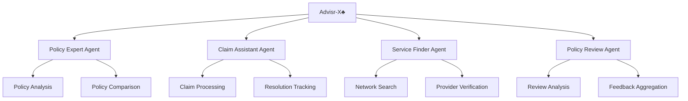
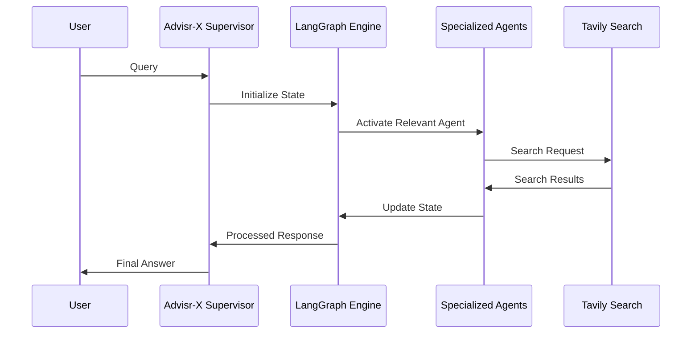

# 🎯 Advisr-X ♣️ - Interactive Insurance Assistant

<div align="center">

[](https://github.com)
[](https://github.com)
[](https://github.com)

<br/>

[](https://github.com/langchain-ai/langgraph)
[](https://github.com/langchain-ai/langchain)
[](https://tavily.com/)

</div>

## 🛠️ Technologies Used

### 🔄 Core Framework

- **LangGraph** - Advanced agent orchestration and workflow management
  - Directed graphs for agent communication
  - State management across agent interactions
  - Parallel agent execution capabilities

- **LangChain** - Foundation for AI/LLM interactions
  - Prompt management and optimization
  - Memory systems for context retention
  - Tool integration framework

- **Tavily Search API** - Intelligent information retrieval
  - Real-time insurance policy searches
  - Accurate claim process information
  - Up-to-date provider network data

## 🌟 Overview

Advisr-X ♣️ is a sophisticated multi-agent architecture designed to provide comprehensive insurance-related assistance. The system uses specialized agents coordinated by a central Advisr-X ♣️ agent to handle various insurance-related queries and tasks.

## 🎯 Problems Solved

### 🔍 1. Insurance Complexity

- 📚 Simplifies complex insurance terminology and policies
- 🌐 Makes insurance information accessible to everyone
- 🔄 Reduces confusion around policy comparisons
- ✅ Helps users make informed decisions about coverage

### ⚡ 2. Claims Process Navigation

- Streamlines complicated claims procedures
- Reduces claim filing errors and delays
- Provides step-by-step guidance
- Tracks and manages claim resolution

### 3. Service Provider Access

- Eliminates difficulty in finding network providers
- Ensures service provider compatibility with insurance
- Simplifies access to cashless facilities
- Provides real-time availability information

### 4. Customer Experience Enhancement

- Addresses lack of transparent feedback
- Provides real user experiences and insights
- Helps avoid common pitfalls
- Offers data-driven recommendations

### 5. Time and Effort Savings

- Automates insurance research process
- Reduces manual documentation work
- Provides instant access to relevant information
- Minimizes back-and-forth with insurance providers

## ✨ Features

### 🤖 1. Policy Expert Agent

- 📚 Provides detailed information about insurance policies
- ⚖️ Compares different insurance policies side-by-side
- 📋 Explains policy features, benefits, and exclusions
- 🔍 Sources information from official documentation

### ⚡ 2. Claim Assistant Agent

- 📝 Guides users through claim filing processes
- 🤝 Provides actionable, empathetic claim guidance
- 📊 Tracks claim resolution attempts
- 🔄 Compares claim processes between providers
- 💡 Recommends strategies for successful claims

### 🏥 3. Service Finder Agent

- 🔍 Locates network hospitals and repair networks
- 📍 Helps find service providers based on location
- ✅ Verifies policy compatibility with service providers
- 📞 Provides contact information and procedures

### 📊 4. Policy Review & Feedback Agent

- 📈 Analyzes customer reviews and feedback
- 💬 Provides insights on claim experiences
- ⚠️ Identifies common challenges and solutions
- 🎯 Helps make informed insurance decisions

## 💫 Core Capabilities

### 📋 Policy Information

- 📊 Detailed policy analysis and comparison
- ✅ Coverage details and eligibility criteria
- 💰 Premium information and policy terms
- ⚠️ Exclusions and limitations

### ⚡ Claims Processing

- 📝 Step-by-step claim filing guidance
- 📑 Required documentation checklists
- ⏱️ Processing timelines and expectations
- 🚫 Common pitfalls and solutions

### 🏥 Network Services

- 🏪 Hospital and repair shop networks
- 💳 Cashless facility information
- ✔️ Pre-authorization procedures
- 📞 Contact details and locations

### 🌟 Customer Experience

- 💬 Real user feedback and reviews
- ⏰ Claim success rates and timelines
- 📊 Service quality assessments
- ⚠️ Provider-specific challenges

## 🚀 Using Advisr-X ♣️

### 🎯 Getting Started

1. 💭 Ask a question about any insurance-related topic
2. 🤖 The system will automatically route your query to the most appropriate agent
3. 📝 Receive detailed, sourced information and guidance

### 💡 Example Queries

- 🔄 "Compare HDFC Life Click 2 Protect Super with LIC Term Plan"
- 📝 "How do I file a claim with Allstate?"
- 🏥 "Find network hospitals for Star Health claims near Mumbai"
- ❓ "What challenges do people face with ICICI Lombard car insurance claims?"

### ✨ Best Practices

- 🎯 Be specific about your insurance provider when asking questions
- 📍 Include location information for network-related queries
- 📋 Specify policy names when requesting comparisons
- ⏰ Mention timeline requirements for claim-related questions

## Agent Workflow Architectures

### Coordination Layer

The Advisr-X ♣️ system uses a hierarchical agent architecture where a central supervisor agent coordinates the activities of specialized sub-agents:



### Agent Communication Flow

1. **Query Reception**
   - User input is received by the Advisr-X Supervisor
   - Natural language processing identifies query intent
   - Query is routed to appropriate specialized agent

2. **Task Execution**
   - Specialized agents process assigned tasks
   - Access relevant data sources and tools
   - Generate detailed responses
   - Handle sub-tasks independently

3. **Response Coordination**
   - Results are collected by supervisor
   - Cross-agent verification when needed
   - Final response compilation
   - Delivery to user with citations

### Specialized Agent Roles

#### Policy Expert Agent

- Maintains policy database
- Performs feature comparison
- Validates current information
- Generates structured analysis

#### Claim Assistant Agent

- Tracks claim status
- Manages resolution attempts
- Escalates complex cases
- Provides procedural guidance

#### Service Finder Agent

- Maintains provider networks
- Validates service compatibility
- Generates location-based recommendations
- Updates availability information

#### Policy Review Agent

- Aggregates user feedback
- Analyzes review patterns
- Identifies common issues
- Generates insight summaries

### System Intelligence

#### Adaptive Routing

- Dynamic task allocation
- Load balancing between agents
- Priority-based processing
- Real-time performance monitoring

#### Knowledge Sharing

- Cross-agent information exchange
- Shared learning repository
- Synchronized updates
- Conflict resolution protocols

## 🔧 Technical Implementation

### 🏗️ Architecture Components

#### 1. LangGraph Integration
- **State Management**
  - Implements `AgentState` class for maintaining conversation context
  - Uses directed graph nodes for agent workflow control
  - Manages memory and context across agent interactions
  
- **Agent Orchestration**
  - Defines agent relationships using graph edges
  - Implements parallel execution for independent tasks
  - Handles conditional branching based on query types

#### 2. LangChain Framework
- **Chain Components**
  - `ConversationBufferMemory` for context retention
  - `OpenAIEmbeddings` for semantic search
  - Custom prompt templates for each agent type
  
- **Tool Integration**
  - Custom tools for policy search and comparison
  - Network provider database access
  - Claim processing utilities

#### 3. Tavily Search Integration
- **Intelligent Search**
  - Real-time insurance policy information retrieval
  - Natural language query processing
  - Result ranking and relevance scoring
  
- **Data Sources**
  - Insurance provider documentation
  - Policy terms and conditions
  - Network provider databases
  - Customer reviews and feedback

### 💾 Data Flow



### 🔄 State Management

1. **Conversation State**
   ```python
   class AgentState:
       conversation_history: List[Message]
       current_agent: str
       active_tasks: Dict[str, Task]
       context: Dict[str, Any]
   ```

2. **Agent States**
   - Policy Expert: Policy comparison and analysis state
   - Claim Assistant: Claim processing workflow state
   - Service Finder: Search and verification state
   - Policy Review: Feedback aggregation state

### 🛠️ Implementation Details

#### Agent Configuration
```python
# Example agent configuration
policy_expert = Agent.from_type(
    agent_type="policy_expert",
    llm=ChatOpenAI(temperature=0),
    tools=[
        PolicySearchTool(),
        PolicyCompareTool(),
        CoverageLookupTool()
    ],
    memory=ConversationBufferMemory()
)
```

#### Graph Definition
```python
# Example workflow graph
workflow = StateGraph(AgentState)

# Add nodes
workflow.add_node("policy_expert", policy_expert)
workflow.add_node("claim_assistant", claim_assistant)

# Define edges
workflow.add_edge("policy_expert", "claim_assistant")
    .when(lambda state: state.requires_claim_info)
```

## Contributions
Feel free to contribute to this project by:
- Adding new insurance providers
- Improving agent capabilities
- Enhancing documentation accuracy
- Reporting bugs or suggesting features

## License
This project is licensed under standard terms. Please check the license file for details.

---
*Note: All information provided by Advisr-X ♣️ is sourced from official documentation and reputable sources. For the most current information, always verify with your insurance provider.*
